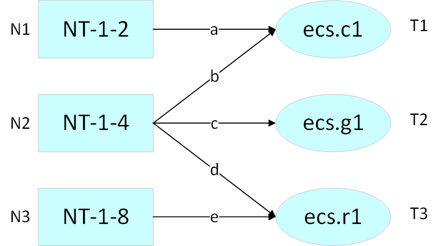

## 代码运行

拷贝数据文件至./input_vm下

执行./run.sh

## 2020年4月1日19时修改

- 发现有部分机器的截止时间是晚于最后加入的机器的，修正调度截止时间为添加的所有机器中最晚的释放时间
- 融合动态报备策略，以此能够适应逐步递增的业务需求，在公共数据集上，收益率提升了8%+
  - 初步融合后考虑到如果遇到单日暴增需求的场景下可能会导致机器购买量过多，机器购买成本过高，所以将该值在当前需求量的基础上，设置最大二倍增上限，从而如果遇到单日暴增需求情况下不会浪费过多机器

## 2020年4月1日14时修改

对于NT-1-4机型，支持的虚拟主机比较多，之前的规划策略产生的结果，发现r1虚拟机基本是没有安排进入NT-1-4的，说明碎片防止产生的程序根本没有机会去起作用。所以新版本中将目标函数的k值计算过程中，融合进入了当前对r1虚拟机的需求值的计算。但是可能因为参数调整还不够好，收益率仅仅提升了0.001%。。

## 设计特点

- 所有的参数程序通过读取json文件进行配置，对于变化的情况可以自由调整
- 通过线性规划每天计算最佳的资源分配方式
- 通过保底报备策略共同防止断供
- 设计资源比例分配方案以减少浪费

## 设计思路

### 对物理机以虚元作为单位进行分配

本题目需要将三种物理机资源合理的分配给九种虚拟主机，但是经过对比分析后发现，其实九种虚拟主机中可以按“CPU内存比”分为三种类型，即为

|资源类型|ecs.c1 | ecs.c2 | ecs.c3|
|-|-|-|-|
|CPU|1|1|1|
|Memory|2|4|8|

不妨自定一个“虚元”的概念，每一个虚元相当于一个最基本的规划单位

每种虚拟主机的子类别即可拆分为各自的"虚元"的倍数：如ecs.c1.large即相当于两个1U2G虚元。

基于如上定义，可以将虚拟机需求拆分为三种不同数量的虚元的需求。

设：
- 三种物理主机的数量为N1,N2,N3
- 三种虚拟主机的“虚元”数量为T1,T2,T3
- 物理资源可能的5种分配方式中涉及的虚元数分别为a,b,c,d,e
 
基于以上定义，资源分配需求如下图所示



此时本问题转换为线性规划问题，约束条件和目标函数为


由此，即可进行求解最佳的资源分配方案

因为无需考虑虚拟机迁移的资源消耗，所以每天都将现有的虚拟主机和新申请的虚拟主机通过上述的分配策略进行计算，反馈结果为{a,b,c,d,e}，即为每种渠道可以安排的虚元数

#### k值的计算

k值的含义为每种虚元在放置时的收益，可取决于多种方案，本设计过程中进行了多种因素的融合计算

- 正向因素
  - 日收入
- 反向因素
  - 均摊物理机费用
  - 日维护费用
- 比例因素
  - 当前该类物理主机的资源使用率

根据上述因素，进行合理的参数调整，以实现最大的收益

##### 比例因素-资源使用率

对于比例因素中的“当前该类物理主机的资源使用率”的计算采用分段函数的思想，每天规划主机前，先遍历计算得到每台物理主机的实际资源使用率。将资源使用率再经过分段函数进行转化，从而资源使用率过高时将避免使用该类型资源。防止断供。

### 将分配到的虚元进行负载均衡

上述的大块资源的分配思想基于虚元的概念，没有考虑具体布置到设备上后负载均衡的问题。最终很容易产生很多内存碎片，导致资源的浪费

为了防止CPU和内存碎片的产生，申请到的大块资源内将进行负载均衡

分配思想如下：

- 对于NT-1-2型和NT-1-8型物理主机，支持的虚拟主机很单一，直接分配即可。
- 对于NT-1-4型物理主机，支持三种机型
  - 设三种虚拟机型ecs.c1 ecs.g1 ecs.r1的数量分别为A,B,C
  - 设分配给三种机型的CPU总量为X 内存总量为Y
  - 满足的条件如下
    ```
    A+B+C = X
    2A+4B+8C = Y
    8X = 3Y
    ```
  - 解方程得，分配资源时，每台NT-1-4型主机内，三种虚拟机型的数量需满足
    ```
    A = 2B +8C
    ```
  - 所以在调度过程中，记录当前A,B,C三个值的“需求度”，每次选取需求度最大的主机进行放置
  - 需求度计算规则：
    - 当机器内放置ecs.c1虚拟主机时
      - g1需求度+0.09
      - c1需求度-1
    - 当机器内放置ecs.g1虚拟主机时
      - g1需求度-1
      - c1需求度+10
      - r1需求度+1
    - 当该机器内放置ecs.r1虚拟主机时
      - g1需求度+0.09
      - r1需求度-1
  - 通过上述规则，可减少NT-1-4主机的碎片生成

### 报备策略

经过对现有数据集的分析，发现每日新增的主机数量是没有规律的。所以没有探索报备的预测算法。

维护了一个每种资源的保底数量，初始状态通过config.json中的initNum参数进行设置。

每天计算前10天(不满10天则计算从第0天开始)内，各类机型的需求总量。若新的需求量大于现有保底量，则更新保底量，后续一直持续该总量的保底，从而应对逐步增长的ECS需求。
